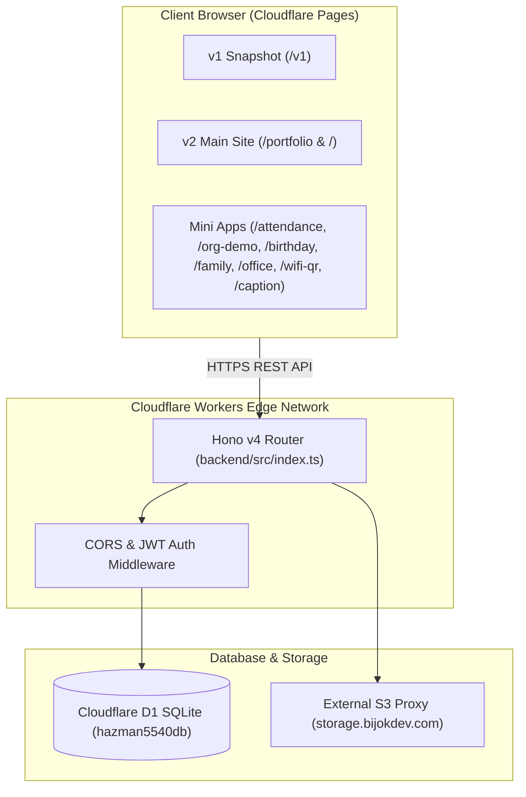
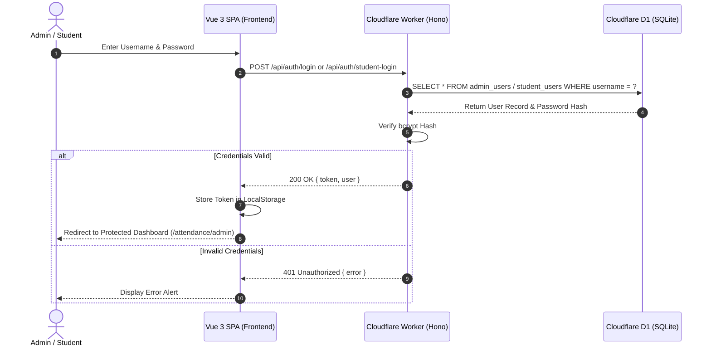
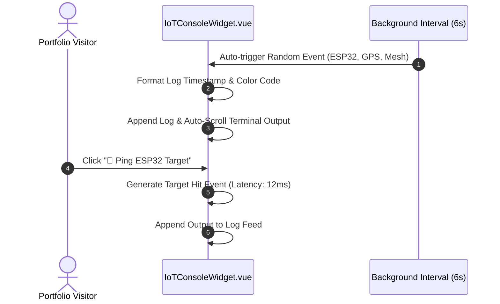

# Architecture and Flow Specifications — hazman5540

> [!NOTE]  
> **Last Updated:** 2026-07-28T19:55:00+08:00  
> **Codebase State:** Reflects codebase state as of Portfolio v2 polish, action-oriented copywriting, Technical Notes Reader Modal, Hono v4 backend routes, Cloudflare D1 integration, and dual light/dark mode system.

---

## 1. High-Level System Architecture & Role Hierarchies

### System Architecture Overview
`hazman5540` follows a decoupled Jamstack architecture:
- **Frontend SPA**: Built with Vue 3 and Vite, deployed on Cloudflare Pages.
- **Serverless API**: Edge-computed API powered by Hono v4 running on Cloudflare Workers.
- **Database Layer**: Cloudflare D1 (SQLite engine) bound as `env.DB`.
- **Storage Layer**: Custom image & attachment hosting via `storage.bijokdev.com`.



### Role & Permission Matrix

| Role | Scope / Permissions | Authentication Mechanism |
| :--- | :--- | :--- |
| **Public / Guest** | View Portfolio v1 & v2, submit contact messages, trigger IoT live terminal actions, view public org charts, generate WiFi QR codes, submit birthday wishes. | Unauthenticated |
| **Student / Intern** | Submit daily attendance clock-in/out, view personal attendance logs, apply for leave, manage personal birthday cards. | JWT Bearer Token (`/api/auth/student-login`) |
| **Admin** | Approve/reject leave requests, view all student attendance logs, generate student accounts, manage family size database, manage office shirt size lists. | JWT Bearer Token (`/api/auth/login`) |

---

## 2. Directory Tree Specification

```
hazman5540/
├── AGENTS.md                   # Non-negotiable project working principles & rules
├── LEARNINGS.md                 # Project learnings and session records
├── README.md                    # Root overview
├── package.json                 # Workspace root package definition
├── backend/                     # Cloudflare Worker backend (Hono v4)
│   ├── wrangler.toml            # Cloudflare Worker bindings (DB = hazman5540db)
│   ├── tsconfig.json
│   └── src/
│       ├── index.ts             # Hono app bootstrap & route registration
│       ├── types.ts             # TypeScript interfaces (Env bindings)
│       ├── middleware/
│       │   └── cors.ts          # Global CORS configuration
│       └── routes/
│           ├── auth.ts          # Admin & Student authentication routes
│           ├── attendance.ts    # Clock-in/out, leave requests, attendance logs
│           ├── birthday.ts      # Birthday card creation & wish submission
│           ├── family.ts        # Family clothing size tracker CRUD
│           ├── finance.ts       # Finance transactions CRUD
│           ├── office.ts        # Office shirt size list CRUD
│           ├── orgchart.ts      # Organization chart D1 CRUD
│           ├── photocollection.ts # Photo gallery items API
│           ├── portfolio.ts     # Portfolio visitor tracker API
│           ├── proxy.ts        # Image proxy route
│           └── system.ts        # System status & diagnostic routes
└── frontend/                    # Vue 3 Single Page Application
    ├── index.html               # Main HTML entry point
    ├── vite.config.ts           # Vite build configuration
    ├── tailwind.config.js       # Tailwind CSS v2 theme tokens & radius configuration
    ├── src/
    │   ├── main.ts              # Vue 3 bootstrap & router mounting
    │   ├── index.css            # Global CSS, Playfair Display fonts & focus-ring utility
    │   ├── api/
    │   │   └── client.ts        # Centralized Fetch HTTP client wrapper
    │   ├── composables/
    │   │   └── useTheme.js      # Light & Dark mode reactive state toggle
    │   ├── router/
    │   │   └── index.ts         # All SPA routes & navigation guards
    │   ├── services/
    │   │   ├── storageService.js           # Photo gallery upload service
    │   │   └── attendanceStorageService.js  # Attendance photo upload service
    │   ├── components/
    │   │   ├── ErrorBoundary.vue
    │   │   └── v2/             # Whimsical Cozy Nocturnal v2 components
    │   │       ├── Navbar.vue            # Floating pill navbar with sliding indicator & theme toggle
    │   │       ├── StarField.vue         # Canvas particle background
    │   │       ├── HeroSection.vue       # Hero banner & CTA buttons
    │   │       ├── IoTConsoleWidget.vue  # Live interactive IoT bash terminal
    │   │       ├── AboutSection.vue      # Bio, degrees & skill matrix
    │   │       ├── ExperienceSection.vue # Career timeline & references grid
    │   │       ├── ProjectCarousel.vue   # 18-project carousel with category filter tabs
    │   │       ├── WritingSection.vue    # Technical notes & reflections
    │   │       ├── ContactSection.vue    # Interactive contact form
    │   │       ├── DoodleDecorations.vue # Hand-drawn line art SVG doodles
    │   │       └── WavyDivider.vue       # Gold/terracotta SVG section divider
    │   └── views/
    │       ├── v1/              # Preserved v1 Classic snapshot (/v1)
    │       ├── v2/              # Whimsical Cozy Nocturnal v2 (/portfolio & /)
    │       └── [mini-apps]/     # Attendance, Birthday, OrgChart, WiFi-QR, Caption, etc.
```

---

## 3. Core Feature Workflows (Mermaid Diagrams)

### Workflow 1: Authentication & JWT Authorization


### Workflow 2: Interactive IoT Telemetry Widget (Hero Section)


---

## 4. Frontend State & Caching Strategy

1. **Theme State (`useTheme.js`)**:
   - Maintains reactive `isDark` ref.
   - Syncs with `localStorage.getItem('theme')` ('dark' | 'light').
   - Toggles `.dark` class on `document.documentElement`.
2. **Navigation Pill State (`Navbar.vue`)**:
   - Calculates active link `offsetLeft` and `offsetWidth` dynamically via `nextTick`.
   - Recalculates indicator geometry on window resize or route change.
3. **Data Caching**:
   - API calls use `fetch` wrapped in `src/api/client.ts`.
   - Visitor counter uses LocalStorage fallback (`hazman5540_visitor_count`) if edge request fails.
