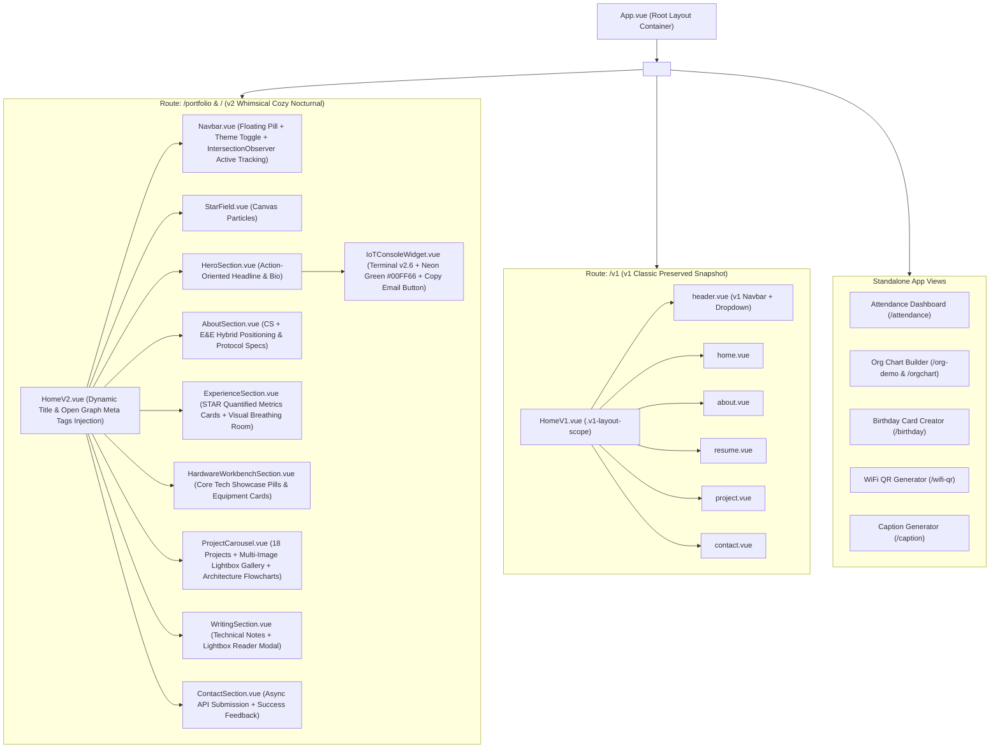

# Frontend Architecture and Styling Specifications — hazman5540

> [!NOTE]  
> **Last Updated:** 2026-07-28T19:55:00+08:00  
> **Codebase State:** Reflects Vue 3 SPA architecture, dual light/dark mode system, Tailwind CSS design tokens, Recruiter Command Terminal v2.6 with neon green contrast & copy actions, Technical Notes Lightbox Reader Modal, Multi-Image Lightbox Gallery, and SEO Open Graph meta tags.

---

## 1. Visual Component Tree Hierarchy



---

## 2. Design Tokens and Styling System

### Semantic Color Tokens (`tailwind.config.js`)

| Token Name | Light Mode Hex | Dark Mode Hex | Usage & WCAG Status |
| :--- | :--- | :--- | :--- |
| `v2.bg` | `#FAF7F2` | `#0F0F0F` | Main Page Background |
| `v2.surface` | `#FFFFFF` | `#1A1A1A` | Cards, Panels & Terminal Containers |
| `v2.subtle` | `#F0EBE1` | `#242424` | Badge Backgrounds & Active Pill Container |
| `v2.terracotta` / `v2.gold` | `#B5502F` | `#E8C976` | Main Headings & Accents (**5.6:1 Light / 12.1:1 Dark - WCAG AA**) |
| `v2.muted` | `#6E655F` | `#8A8A8A` | Secondary Subtitles (**4.8:1 Light / 4.7:1 Dark - WCAG AA**) |
| `v2.border` | `#E6E0D4` | `#2A2A2A` | Card Borders & Dividers |

### Standardized Typography Scale

| Hierarchy | Tailwind Classes | Size / Weight | Usage |
| :--- | :--- | :--- | :--- |
| **Hero Title** | `text-4xl sm:text-6xl md:text-7xl` | 36px–72px / Serif | Hero Display (`Hazman Adanan`) |
| **Section Title** | `text-3xl sm:text-4xl md:text-5xl` | 30px–48px / Serif | Section Main Headings |
| **Card Title** | `text-lg sm:text-xl` | 18px–20px / Serif Semibold | Project & Experience Cards |
| **Body Text** | `text-sm sm:text-base` | 14px–16px / Sans Normal | Descriptions & Paragraphs |
| **Caption / Tag** | `text-xs` / `text-[11px]` | 11px–12px / Mono | Status Badges, Tech Tags & Terminal Output |

---

## 3. Global Utility CSS Classes (`src/index.css`)

```css
/* 1. Keyboard Accessibility Focus Ring */
.focus-ring {
  @apply focus:outline-none focus-visible:ring-2 focus-visible:ring-[#B5502F] dark:focus-visible:ring-[#E8C976] focus-visible:ring-offset-2 focus-visible:ring-offset-[#FAF7F2] dark:focus-visible:ring-offset-[#0F0F0F];
}

/* 2. Glassmorphism Card Container */
.glass-card {
  @apply bg-white/80 dark:bg-secondary/80 backdrop-blur-lg border border-white/30 dark:border-slate-700/30 shadow-xl;
}

/* 3. Gradient Text Accent */
.gradient-text {
  @apply bg-gradient-to-r from-teal-500 via-cyan-400 to-blue-500 bg-clip-text text-transparent;
}
```

---

## 4. State Management Architecture

1. **Theme Composable (`src/composables/useTheme.js`)**:
   - Manages reactive `isDark` state across v1, v2, and mini-apps.
   - Syncs active selection with `localStorage.setItem('theme', 'dark' | 'light')`.
   - Modifies `document.documentElement.classList` (`dark`).

2. **Photo Collection Store (`src/store/index.ts`)**:
   - Centralized Vuex store managing state for uploaded photo collections, category filters, and modal image selection.
