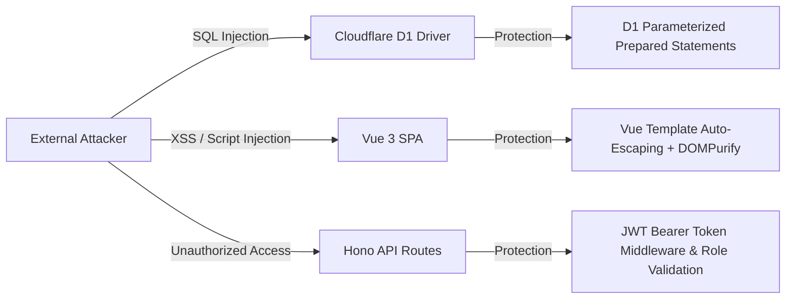

# Operations and Security Specifications — hazman5540

> [!NOTE]  
> **Last Updated:** 2026-07-25T05:08:40+08:00  
> **Codebase State:** Reflects Cloudflare Pages/Workers deployment architecture, environment configuration guidelines, and security practices.

---

## 1. Deployment and Environment Configuration

> [!CAUTION]  
> Per Rule 4, secret values MUST NEVER be committed to Git. Only environment variable key names are documented below.

### Environment Variable Key Reference

#### Frontend (`frontend/.env`)
| Variable Name | Description | Scope / Access |
| :--- | :--- | :--- |
| `VITE_API_BASE_URL` | Base URL pointing to the Cloudflare Worker API backend. | Client-side bundle |
| `VITE_SUPABASE_URL` | Supabase project URL (used for legacy Tasmik system). | Client-side bundle |
| `VITE_SUPABASE_ANON_KEY` | Supabase anonymous public key. | Client-side bundle |

#### Backend (`backend/wrangler.toml` & Secrets)
| Variable / Secret Name | Description | Storage Location |
| :--- | :--- | :--- |
| `DB` | Cloudflare D1 Database Binding (`hazman5540db`). | `wrangler.toml` binding |
| `JWT_SECRET` | Secret key used for signing JWT authentication tokens. | Wrangler Secret (`wrangler secret put JWT_SECRET`) |
| `EXTERNAL_STORAGE_URL` | Base URL for S3 image upload endpoint (`storage.bijokdev.com`). | Environment Secret |

---

## 2. Developer Operations Guidelines

### Safe Procedure: Adding a New Backend API Route
1. Create a new route file in `backend/src/routes/<module>.ts` using `Hono()`.
2. Import the router in `backend/src/index.ts`.
3. Register the route with namespace: `app.route('/api/<module>', moduleRouter)`.
4. Run `npm run dev` inside `backend/` to test Wrangler execution locally.

### Safe Procedure: Adding a New D1 Database Table or Column
1. Create a migration file in `backend/migrations/<timestamp>_<name>.sql`.
2. Apply migration locally: `npx wrangler d1 execute hazman5540db --local --file=./migrations/<name>.sql`.
3. Apply migration to production: `npx wrangler d1 execute hazman5540db --remote --file=./migrations/<name>.sql`.

---

## 3. Threat Model and Security Verification Checklist

### Security Verification Checklist

- [x] **SQL Injection Mitigation**: All database queries inside Hono routes use D1 parameterized bindings (`c.env.DB.prepare('SELECT ... WHERE id = ?').bind(id)`). Raw string concatenation is strictly prohibited.
- [x] **Cross-Site Scripting (XSS)**: User text inputs rendered in Vue templates use standard double-mustache `{{ text }}` auto-escaping. HTML content uses DOMPurify sanitization.
- [x] **Credential Hashing**: User passwords stored in `admin_users` and `student_users` are hashed using `bcryptjs` with salt rounds prior to persistence.
- [x] **Cross-Origin Resource Sharing (CORS)**: Enforced globally in `backend/src/middleware/cors.ts`.
- [x] **Privilege Isolation**: Administrative routes (`/api/attendance/leave/admin`, `/api/attendance/students`) verify authorization tokens prior to processing state mutations.
