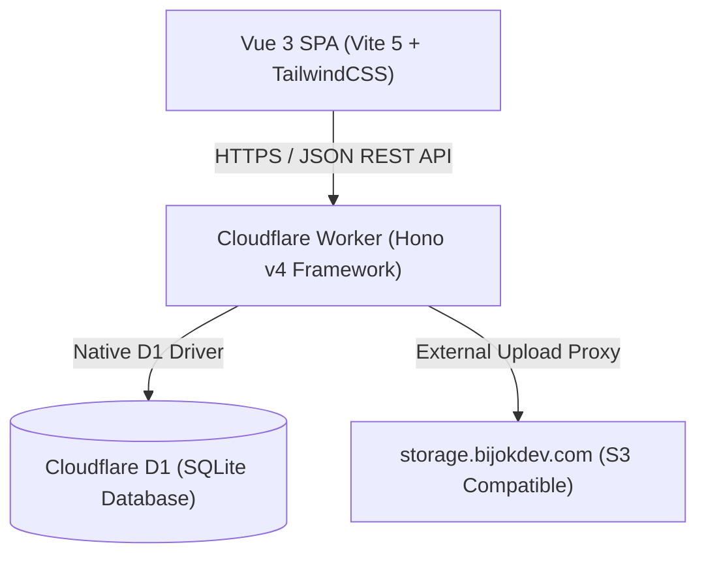

# hazman5540 — Production Documentation Suite

> [!NOTE]  
> **Last Updated:** 2026-07-28T19:55:00+08:00  
> **Codebase State:** Reflects Portfolio v2 polish, action-oriented copywriting, neon green terminal contrast, Technical Notes reader modal, multi-image lightbox gallery, CLI copy email button, SEO Open Graph meta tags, clean print stylesheet, and updated resume PDF (`Hazman's-resume-july-2026.pdf`).

---

## 1. Documentation Suite Index

| Document | Description | Target Audience |
| :--- | :--- | :--- |
| [ARCHITECTURE_AND_FLOWS.md](./ARCHITECTURE_AND_FLOWS.md) | System architecture, directory structure, Mermaid flow diagrams, state management, and data caching. | Solution Architects & Lead Developers |
| [DATABASE_AND_CRUD.md](./DATABASE_AND_CRUD.md) | D1 DDL schema scripts, table relationships, CRUD status matrix, and top 5 SQL queries. | DBAs & Backend Engineers |
| [API_REFERENCE.md](./API_REFERENCE.md) | Exhaustive REST API specification for Hono v4 backend endpoints, auth requirements, and JSON schemas. | Full-Stack & Integration Engineers |
| [FRONTEND.md](./FRONTEND.md) | Vue 3 visual component tree, design tokens, dual light/dark theme system, and state flows. | Frontend Developers & UI/UX Designers |
| [OPS_AND_SECURITY.md](./OPS_AND_SECURITY.md) | Cloudflare Pages & Workers deployment setup, environment variables, security threat model, and dev guidelines. | DevOps, SecOps & Maintenance Engineers |
| [PROJECT_TRACKING.md](./PROJECT_TRACKING.md) | Audit trail, AGENTS.md consistency checks, requirement status matrix, and phased TODO list. | Project Managers & AI Agents |

---

## 2. Executive Summary & Core Stack

**hazman5540** is a full-stack portfolio & multi-application platform combining a modern Vue 3 SPA frontend with a serverless Cloudflare Workers API backend backed by Cloudflare D1 (SQLite).

### Technical Stack Matrix



| Layer | Technology / Tool | Version / Details |
| :--- | :--- | :--- |
| **Frontend Framework** | Vue 3 (Composition API + Options API) | Vite 5, TypeScript |
| **Frontend Styling** | TailwindCSS 3 | Dual Light (`#FAF7F2`) & Dark (`#0F0F0F`) Modes |
| **Backend Framework** | Hono v4 | Edge-runtime on Cloudflare Workers |
| **Database** | Cloudflare D1 | Serverless D1 SQLite database (`hazman5540db`) |
| **Auth Engine** | JWT + Web Crypto (`bcryptjs`) | Bearer tokens in LocalStorage/SessionStorage |
| **Visualization & Media**| D3.js (`d3-org-chart`), QRCode Canvas, Leaflet | PDF Export via `html2canvas` + `jspdf` |
| **Hosting Infrastructure**| Cloudflare Pages (Frontend) + Cloudflare Workers (Backend) | Domain: `hazman.bijokdev.com` |

---

## 3. Quick-Start Developer Guide

### Prerequisites
- Node.js `v18.x` or `v20.x`
- npm `v9.x` or higher
- Cloudflare Wrangler CLI (`npm i -g wrangler`)

### Step 1: Clone & Install Dependencies
```bash
# Clone the repository
git clone https://github.com/hazman97/hazman5540.git
cd hazman5540

# Install root & workspace dependencies
npm install
```

### Step 2: Configure Environment Variables
Create `.env` inside `frontend/`:
```ini
# Frontend Environment Configuration (Names only)
VITE_API_BASE_URL=http://localhost:8787
VITE_SUPABASE_URL=https://your-supabase-project.supabase.co
VITE_SUPABASE_ANON_KEY=your-supabase-anon-key
```

### Step 3: Run Local Development Servers

> [!IMPORTANT]  
> The project runs both the Vite frontend server (`5173` or `5175`) and the Cloudflare Wrangler backend server (`8787`).

```bash
# Start backend API dev server (Wrangler + Hono)
cd backend
npm run dev

# In a separate terminal, start frontend dev server (Vite)
cd frontend
npm run dev
```

### Step 4: Production Build Verification
```bash
# Build frontend SPA distribution bundle
cd frontend
npm run build
```
