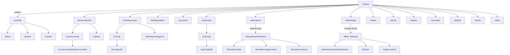

# User Flow — hazman5540

> **Last updated:** 2026-05-16

---

## 1. User Types

| User Type | Description | Auth Mechanism |
|-----------|-------------|----------------|
| **Public Visitor** | Views portfolio, birthday pages, org charts, photo gallery | None |
| **Birthday Page Owner** | Creates & manages birthday pages | `owner_token` (via URL param) |
| **Org Chart Owner** | Creates & edits org charts | `owner_token` (via URL param) |
| **Attendance Student (Intern)** | Clocks in/out, applies for leave, views history | `localStorage` session with JSON validation + 24h TTL |
| **System User (Admin/Finance)**| Accesses protected modules (Attendance Admin, Finance Tracker) based on RBAC | Centralized Google OAuth |
| **Superadmin** | Manages system users and assigns project-level permissions | Centralized Google OAuth + `is_superadmin` flag |
| **E-Claim User** | Demo only — switches between Staff/HOD/Finance/HR roles | Client-side role switcher |
| **Family Editor** | Adds/edits family members when edit mode is enabled | In-app toggle |
| **Office Editor** | Adds/edits office shirt-size entries | Open access (no auth) |

---

## 2. High-Level Navigation Flow

---

## 3. Feature Flows

### 3.1 Portfolio (Public)

1. User lands on `/` → redirected to `/portfolio`
2. Portfolio page shows hero section, E-Resume timeline (with MindGPS Tracker and recent work), and project showcase
3. Navigation bar links to `/about`, `/project`, `/contact`
4. Contact page uses emailjs for form submission
5. Theme toggle (dark/light) available via `useTheme.js`

### 3.2 System & Authentication (RBAC)

1. Admin or Finance user opens `/admin/login` → clicks "Login with Google"
2. Google OAuth verifies identity, backend checks if email exists in `system_users` database (Cloudflare D1)
3. If user exists, backend issues JWT session and fetches `user_permissions`
4. User is redirected to their authorized dashboard (e.g., Attendance Admin or Finance Tracker)
5. Superadmins have access to `/system-admin` to authorize new users and assign project-level permissions (Finance, Attendance, etc.)

### 3.3 Finance Tracker

1. Authorized user navigates to `/finance` (protected by router guard)
2. View 3-Bucket Financial Tracker utilizing Cloudflare D1 and Hono
3. System handles automated Grab business logic (e.g., automated 10% maintenance sinking fund)
4. Add new transactions categorized by wallet and bucket type
5. View current wallet balances and transaction history

### 3.4 Attendance — Student Flow

1. Student opens `/attendance` → login form (username + password)
2. Credentials checked against `attendance_students` Firestore collection (passwords hashed with bcryptjs)
3. On success → `localStorage.attendance_student` set (with `loginAt` timestamp) → redirect to `/attendance/dashboard`
4. Dashboard shows:
   - Location status (geofence check against Tamarind Square coordinates)
   - Clock In / Clock Out button
   - Work duration timer
5. **Clock In:** Opens camera → captures photo → uploads to `attendanceintern` bucket → creates `attendance_logs` doc with `clockInTime`, GPS coords, photo URL
6. **Clock Out:** Same camera flow → updates the same log doc with `clockOutTime`, `totalHours`
7. Student can view history at `/attendance/logs` with calendar/list views
8. **Apply Leave** at `/attendance/apply-leave`: select type (MC/Annual), upload attachment, submit to `leave_requests`
9. **Leave History** at `/attendance/leaves`: view all past leave requests and their statuses

### 3.5 Attendance — Admin Flow

1. Admin authenticates via `/admin/login` with Google OAuth (requires `attendance` permission)
2. Navigates to `/attendance/admin/dashboard` (nested under `AdminLayout.vue`)
3. **Dashboard:** Shows stats (total students, today's present, clocked out, remote), live activity feed
4. **Student Management:** Add/edit/toggle active students via `attendance_students` collection
5. **Attendance Records:** View/filter/export all attendance logs
6. **Settings:** Configure office location, geofence radius, working hours
7. **Leave Requests:** View pending leave applications, approve/reject

### 3.6 Birthday Page Builder

1. User opens `/birthday/create` → 4-step wizard:
   - Step 1: Person name, page title, subtitle
   - Step 2: Choose template (Rose, Party, Minimal, Ocean, Sunset, Galaxy)
   - Step 3: Add YouTube music/video, hero image (uploaded via storage API), settings
   - Step 4: Customize fonts, colors, effects (stars, hearts, confetti, etc.)
2. On submit → creates row in Supabase `birthday_pages` → returns share link + management link
3. Visitors open `/b/:slug` → view the birthday page with animations/music
4. Visitors submit wishes at `/b/:slug/wish` → stored in `birthday_wishes`
5. Owner manages wishes at `/birthday/manage/:id?token=...`
6. Admin overview at `/birthday/admin`

### 3.7 Organization Chart

1. User visits `/org-demo` → sees demo org chart (D3-based)
2. User creates a new chart at `/org/create`: title, description, add employees, upload photos
3. Chart saved to Supabase `org_charts` → generates slug
4. Public view at `/org/:slug` → interactive D3 org chart
5. Owner edits at `/org/:slug/edit` (validates `owner_token`)

### 3.8 Photo Collection

1. Browse countries at `/photocollection`
2. View country photos at `/country/:name`
3. Drill into a location at `/country/:name/location/:location`
4. Upload photos at `/upload`:
   - Select/create country → select/create location
   - Enter title, description, optional video URL
   - Upload image via drag-and-drop → stored via `storageService.js` → metadata saved to Firestore `countries` collection

### 3.9 E-Claim (Demo)

1. Open `/eclaim` → client-side demo with no backend persistence
2. Switch between roles: Staff, HOD, Finance, HR
3. Staff: Submit claims (category, amount, date, receipt, description)
4. HOD/Finance/HR: View pending approvals, approve/reject claims
5. Reports view: total claims value, average, by-category breakdown

### 3.10 WiFi QR Generator

1. Open `/wifi-qr` → enter network name, password, hidden toggle
2. QR code generated live using `qrcode` library
3. Customize theme (Swiss Modern, Warm, Minimal), title, subtitle, footer text
4. Download as PNG, print as themed card, or copy to clipboard

### 3.11 Family Database

1. Open `/family` → loads members from Firestore `family_members`
2. View modes: Grid (grouped by family) or Table
3. Filter by age, gender; sort by name, age, family order
4. Copy formatted list to clipboard (WhatsApp-friendly format)
5. Edit mode: add/edit/delete members (family order, name, role, age, size, gender)

### 3.12 Office Shirt List

1. Open `/office` → loads entries from Firestore `office_baju`
2. Add new entry (name + shirt size)
3. Edit / delete entries
4. Copy formatted list with size summary to clipboard

### 3.13 Converter & Todo List

1. Open `/converter` → utility converter tool (standalone component)
2. Open `/todolist` → local todo list interface with add/remove/toggle functionality

### 3.14 Caption Generator

1. Open `/caption` → two-panel layout (input left, output right)
2. **Select options:** Category (6), Platform (5), Tone (4)
3. **Fill details:** Subject name, date, location, bullet points
4. **Choose mode:**
   - **Template mode:** Uses pre-built templates (40+ variations) — instant, free
   - **AI mode:** Sends structured prompt to Gemini API — natural, contextual captions
5. Click "Jana Caption" / "Jana dengan AI" → output appears with character count
6. **Actions:** Copy to clipboard, Regenerate (new variation), Save to history
7. History (last 10) saved in localStorage, click to reload any past caption
8. Platform-specific formatting: WhatsApp bold, Instagram hashtags, Twitter 280-char limit
